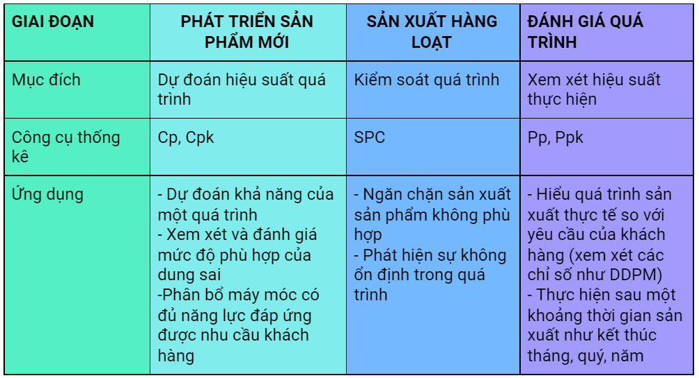

Một trong những câu hỏi phổ biến nhất trên mạng khi tôi tham gia các diễn đàn thảo luận về chủ đề Cp, Cpk và Pp, Ppk đó là:

* Sự khác biệt giữa phân tích năng lực quá trình (Cp, Cpk) và phân tích hiệu suất quá trình (Pp, Ppk)?
* Ứng dụng của (Cp, Cpk) và (Pp, Ppk) là gì?

Trong khi có rất nhiều bài viết về sự khác biệt trong tính toán giữa các chỉ số này, nhưng rất ít bài viết về sự khác biệt trong ứng dụng, tức là nơi mỗi chỉ số này được sử dụng và chúng giúp chúng ta giải quyết những vấn đề sản xuất nào. Do đó, trong bài viết này, tôi sẽ giải thích cách sử dụng tốt nhất từng kỹ thuật này trong môi trường sản xuất.

(Lưu ý rằng bài viết này từ quan điểm của người làm việc trong môi trường sản xuất.)

**Khi nào thì dùng Cp, Cpk và Pp, Ppk**

### **\[Tiềm năng] Phân tích năng lực quá trình (Cp)**

Một nghiên cứu năng lực quá trình sử dụng dữ liệu từ một mẫu để **DỰ ĐOÁN** khả năng của một quá trình sản xuất để tạo ra các chi tiết phù hợp với thông số kỹ thuật

Dự đoán này cho phép chúng ta “xác nhận” một quá trình sản xuất mới là phù hợp để sử dụng trong sản xuất. Do đó, Phân tích năng lực của quá trình được sử dụng tốt nhất trong quá trình Chạy sản phẩm mới (NPI), hoặc vào đầu mỗi ngày hoặc mỗi ca sản xuất như một phương pháp kiểm tra xem một quá trình có nằm trong tầm kiểm soát và có khả năng sản xuất các chi tiết đáp ứng các thông số kỹ thuật hay không.

Lưu ý rằng khi chúng ta nói về khả năng của quá trình, chúng ta có xu hướng bỏ qua một từ quan trọng: **"tiềm năng"**. Chỉ số Cp cung cấp một thước đo về khả năng tiềm năng của quá trình, tức là quá trình có thể thực hiện tốt như thế nào nếu không có thay đổi trong các điều kiện cơ bản của quá trình.

Tuy nhiên, chúng ta đều biết rằng trong thế giới thực, các điều kiện cơ bản của quá trình thay đổi liên tục - dụng cụ hao mòn, người vận hành thay đổi, máy móc nóng lên, bỏ qua bảo trì, nguyên liệu thô thay đổi theo từng lô - và do đó, chúng ta cần một cơ chế để theo dõi, kiểm soát và điều chỉnh hiệu suất của chúng ta theo thời gian. Đó chính là kiểm soát quá trình bằng phương pháp thống kê và cụ thể là Biểu đồ kiểm soát. 

### **Kiểm soát quá trình bằng phương pháp thống kê và Biểu đồ kiểm soát**

SPC là một công cụ để theo dõi và kiểm soát quá trình sản xuất nhằm ngăn chặn việc sản xuất sản phẩm không phù hợp. Thuật ngữ chính ở đây là **"kiểm soát"**. Không giống như phân tích năng lực quá trình và phân tích hiệu suất quá trình trong đó chúng ta đo lường và phân tích mà không thay đổi cài đặt cho đến khi nghiên cứu hoàn tất, SPC yêu cầu chúng ta đo lường, phân tích và hành động theo thời gian thực của phân tích. SPC giúp chúng ta phát hiện sự không ổn định trong quá trình do những thứ như mài mòn dụng cụ, giảm áp suất, thay đổi nhiệt độ v.v. và do đó yêu cầu chúng ta thực hiện các điều chỉnh cần thiết để đảm bảo rằng quá trình trở lại ổn định và tiếp tục sản xuất theo thông số kỹ thuật.

### **\[Thực tế] Phân tích Hiệu suất quá trình (Pp)**

Một nghiên cứu về hiệu suất của quá trình được sử dụng để **ĐÁNH GIÁ** quá trình sản xuất và trả lời câu hỏi: "quá trình thực sự hoạt động như thế nào trong một khoảng thời gian?" Trong việc sử dụng hàng ngày, chúng ta có xu hướng bỏ qua một từ quan trọng **"thực tế"** khỏi tên của phân tích này.

Thiếu từ “Thực tế” trong hiệu suất quá trình và thiếu từ “Tiềm năng” trong năng lực quá trình dẫn đến sự nhầm lẫn đáng kể giữa các học viên.

Phân tích hiệu suất quá trình được sử dụng tốt nhất khi bạn có dữ liệu kiểm tra và bạn muốn sử dụng dữ liệu kiểm tra để hiểu cách quá trình sản xuất của bạn thực sự được thực hiện. Đây là phân tích lịch sử chứ không phải phân tích dự đoán, nhưng vẫn có thể được sử dụng để thúc đẩy cải tiến quá trình.

### **Sự khác biệt quan trọng**

Lưu ý rằng một trong những điểm khác biệt quan trọng nhất và lỗi thường mắc phải xảy ra trong quá trình thu thập dữ liệu. Phân tích năng lực quá trình yêu cầu dữ liệu được thu thập trong **trình tự** sản xuất, tức là theo thứ tự các chi tiết được sản xuất.

Điều này là do phân tích năng lực quá trình được dự đoán dựa trên quá trình **ổn định theo thời gian** và chúng ta phải đo lường và so sánh sự thay đổi của quá trình **theo thời gian** để xác định **tính ổn định**. Mặt khác, phân tích hiệu suất quá trình không yêu cầu dữ liệu trong sản xuất theo trình tự vì nó sử dụng độ lệch chuẩn tổng thể và không quan trọng thứ tự các chi tiết được sản xuất theo thứ tự nào.

Cp và Cpk yêu cầu quá trình sản xuất phải ổn định, trong khi Pp và Ppk không yêu cầu quá trình ổn định. Vì vậy, Cp và Cpk là **hiệu suất tốt nhất mà quá trình có thể thực hiện khi nó ổn định**, và Pp và Ppk là **hiệu suất thực tế** so với lý thuyết tốt nhất đó.